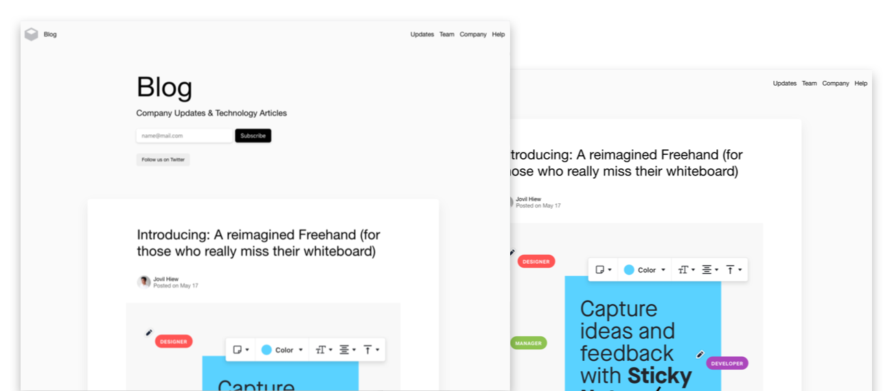

# GHSC201 Ghost theme

A single column Ghost theme that's easily customisable for developers and designers and a great starter theme. 
Puts focus on the content and works seamlessly for both indiviuals and teams.

Features:
- Support for different [languages](http://themes.ghost.org/docs/i18n#section-how-to-add-any-language)
- Responsive layout
- Primary Menu in Header
- Secondary Menu in Footer
- Infinite scroll
- Page for (Home, Post, Page, Author, Tag)
- Custom Page with Form
- Social Media
- Code syntax [Prismjs](http://prismjs.com/index.html#languages-list). Supports all syntax.

## Development

Requirements: [Node](https://nodejs.org/), [Yarn](https://yarnpkg.com/) and [Gulp](https://gulpjs.com).

Install [Yarn](https://classic.yarnpkg.com/en/docs/cli/install/) dependencies:

	yarn install

Run development server:

	yarn dev

Compress and minify files into `dist/<theme-name>.zip`, which you can then upload to your site.

	yarn zip
